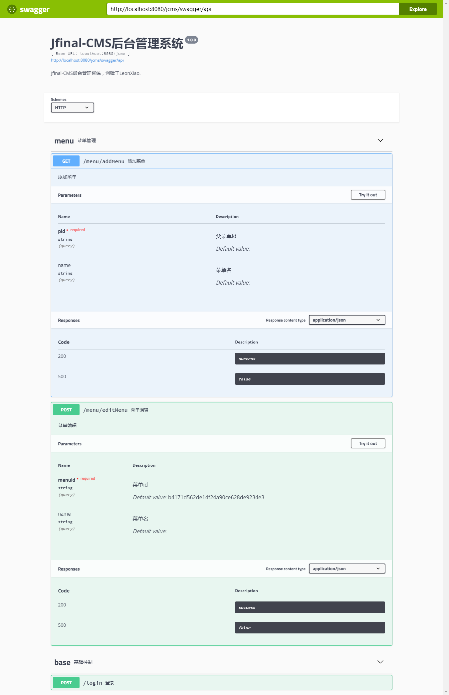

# swagger4jfinal
[](https://www.codacy.com/app/xiaoxinruiyouxiang/swagger4jfinal?utm_source=github.com&amp;utm_medium=referral&amp;utm_content=LeonXiaoX/swagger4jfinal&amp;utm_campaign=Badge_Grade)

**项目说明** 
- 开发可将Swagger集成到JFinal中的组件
- 已添加为Jfinal插件，可直接配置*.properties文件初始化该组件
<br>

**项目结构** 
```
swagger4jfinal
    │
    ├─annotation  提供可注解的内容
    │ 
    ├─config      默认配置
    │ 
    ├─controller  默认访问路径
    │
    ├─core        注解实现核心包
    │
    ├─exception   自定义异常
    │
    ├─model       注解对象
    │
    ├─plugin      注册为Jfinal插件
    │
    ├─utils       工具包
    │
```

<br>

 **技术选型：** 
- 框架：Jfinal 2.2

<br>

 **使用说明：** 
- 1、下载releases文件夹中swagger4jfinal-1.0.0.jar，将其添加至项目环境中
 *或者* clone该项目，使用maven构建工具，mvn clean 、mvn install，然后添加依赖
```
<dependency>
    <groupId>org.leon</groupId>
    <artifactId>swagger4jfinal</artifactId>
    <version>1.0.0</version>
</dependency>
```

- 2、下载 swagger-ui，将其添加至项目中，参考结构如下：
```
webapp
    static
        swagger
            favicon-16x16.png
            ...
            swagger-ui.js.map
    WEB-INF
        view
            swagger
                index.html
```

- 3、Jfinal配置类中添加Swagger路由控制
```
/**
 * 配置访问路径
 * @param routes
 *              访问路径
 */
 @Override
 public void configRoute(Routes routes) {
    routes.setBaseViewPath("/WEB-INF/view");
    ...
    routes.add(new SwaggerRoute()); // 默认访问路径
}
```
&emsp;*或者*
自建Routes类，参考：
```
public class SwaggerRoutes extends Routes {    
    @Override
    public void config() {
        setBaseViewPath("/WEB-INF/views");
        add("/swagger", SwaggerController.class);
    }
}
```
&emsp;*注*：此处SwaggerController为内置对象，默认提供以下接口：
```
// swagger ui页面
public void index() {
    this.render("/WEB-INF/view/swagger/index.html");
}
// swagger 接口
public void api() {
    ...
}
// swagger.json文件下载
public void downloadJson() {
    ...
}
```
&emsp;也可自行创建Controller类继承该类进行功能扩展

- 4、添加swagger.properties，参考如下：
```
# 扫描包路径
scan_package=com.xxx.xxx.xxx

# swagger基础信息
swagger=2.0
info.description=XXXXXXX.
info.version=1.0.0
info.title=XXXX
host=127.0.0.1
basePath=/xxx
schemes=http,https
```

- 5、Jfinal配置类中注册SwaggerPlugin
```
/**
 * 配置插件
 * @param plugins
 *              插件
 */
@Override
public void configPlugin(Plugins plugins) {
    ...
    
    // 配置Swagger插件
    SwaggerPlugin swaggerPlugin = new SwaggerPlugin("swagger.properties");
    plugins.add(swaggerPlugin);
}
```

- 6、接口处添加注解，参考如下：
```
/**
 * 系统管理 -> 菜单管理
 * @author LeonXiao
 */
@Api(tag="menu", description="菜单管理")
public class MenuController extends Controller{
	...
    /**
     * 菜单编辑
     */
    @ApiOperation(url="/menu/editMenu", tag="menu", httpMethod= HttpMethod.POST, description="菜单编辑")
    @Params({
            @Param(name="menuid", description="菜单id", required=true, dataType="integer", defaultValue="1"),
            @Param(name="name", description="菜单名", dataType="string")
    })
    @Resps({
            @Resp(code="200", description="success"),
            @Resp(code="500", description="false")
    })
    public void editMenu() {
        String menuid = getPara("menuid");
        ...
        render(...);
    }
}
```
&emsp;支持六种注解：
```
@Api(tag="menu", description="菜单管理")
    
@ApiOperation(url="/menu/editMenu", tag="menu", httpMethod=HttpMethod.POST, description="菜单编辑")

@Param(name="id", description="编号", required=true, dataType="integer", defaultValue="1")

@Params

@Resp(code="200", description="success")

@Resps
```

<br>

 **使用效果**

 

若有疑问，欢迎issue！

 **祝君成功！** :hear_no_evil: